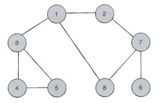

## 그래프 DFS/BFS

### 스택
박스 쌓기에 비유, 선입후출 구조

### 큐
대기줄에 비유, 선입선출 구조

### 재귀함수
자기 자신을 다시 호출하는 함수\
`def 함수명(변수):함수바디
`



### DFS(Depth-first Search)
- 깊이우선탐색
- 깊은 부분을 우선으로 탐색
- 말그대로 그래프에서 가장 최상위 노드부터 하위노드까지 제일깊게 탐색하고, 다시 위로올라와서 깊게 깊게 탐색하는 방법입니다.
```python
# DFS 메서드 정의
def dfs(graph, v, visited):
    # 현재 노드를 방문 처리
    visited[v] = True
    print(v)
    # 현재 노드와 연결된 다른 노드를 재귀적으로 방문
    for i in graph[v]:
        if not visited[i]:
            dfs(graph, i, visited)

    # 각 노드가 연결된 정보를 리스트 자료형으로 표현 (2차원 리스트)
    graph = [
        [],
        [2,3,8],
        [1,7],
        [1,4,5],
        [3,5],
        [3,4],
        [7],
        [2,6,8],
        [1,7]
    ]

    # 각 노드가 방문한 정보를 리스트 자료형으로 표현 (1차원 리스트)
    visited = [False] * 0

    # 정의된 DFS 함수 호출
    dfs(graph, 1, visited)
```

### BFS(Breadth-first Search)
- 너비우선탐색
- 가까운 노드부터 탐색
- 말 그대로 그래프에서 가장 최상위 노드부터 다음 차수(degree)를 모두 탐색하고, 그 다음차수를 모두 너비너비하게 탐색 하는 방법입니다.
```python
from collections import deque

# BFS 함수 정의
def bfs(graph, start, visited):
    # 큐(Queue) 구현을 위해 deque 라이브러리 사용
    queue = deque([start])
    # 현재 노드를 방문 처리
    visited[start] = True
    # 큐가 빌 때까지 반복
    while queue:
        # 큐에서 하나의 원소를 뽑아 출력
        v = queue.popleft()
        print(v)
        # 해당 원소와 연결된, 아직 방문하지 않은 원소들을 큐에 삽입
        for i in graph[v]:
            if not visited[i]:
                queue.append(i)
                visited[i] = True

# 각 노드가 연결된 정보를 리스트 자료형으로 표현(2차원 리스트)
graph = [
  [],
  [2, 3, 8],
  [1, 7],
  [1, 4, 5],
  [3, 5],
  [3, 4],
  [7],
  [2, 6, 8],
  [1, 7]
]

# 각 노드가 방문된 정보를 리스트 자료형으로 표현(1차원 리스트)
visited = [False] * 9

# 정의된 BFS 함수 호출
bfs(graph, 1, visited)
```
###
### 🐯 기본 예제
`3-1. DFS 메서드 정의.py` 📖이코테 p.124  [ ✅ ]\
`3-2. BFS 메서드 정의.py` 📖이코테 p.134  [ ✅ ]\
`3-3. 음료수 얼려 먹기.py` 📖이코테 p.149  [  🧑🏻‍💻 ]\
`3-4. 미로 탈출.py` 📖이코테 p.152  [ 🧑🏻‍💻 ] 
###
### 🦁 심화 예제
`[boj] 21608. 상어 초등학교.py` 📖백준 [ 🧑🏻‍💻 ] \
`[boj] 12933. 오리.py` 📖백준  [  🧑🏻‍💻 ] \